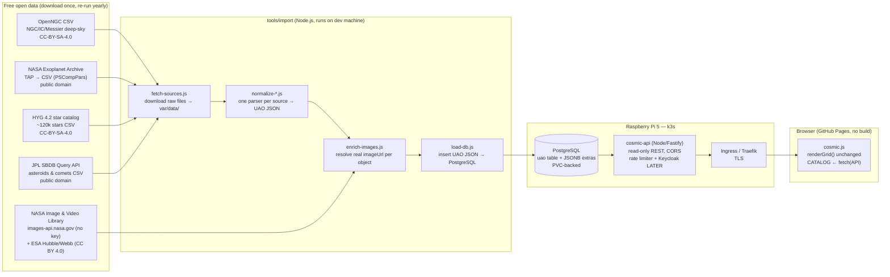

# Plan: Real Data Pipeline — free catalogs → own database → k3s on Raspberry Pi 5

> Companion tests: [`real-data-pipeline-tests.md`](real-data-pipeline-tests.md)
> Status: DRAFT — awaiting developer review
> Created: 2026-07-10

## 1. Objective

Replace the static mock `CATALOG` in `src/ui/cosmic.js` with real, free, openly
licensed astronomical data — downloaded from public archives, normalized into the
`UniversalAstronomicalObject` (UAO) model, stored in a self-hosted database, and
served by a small API deployed on the developer's own Raspberry Pi 5 k3s cluster —
so the app shows the true wonders of the universe as probes captured them, with
zero AI-generated content.

## 2. Diagram

## 3. Model recommendation

| Phase | Steps | Model | Est. tokens | Why |
|-------|-------|-------|-------------|-----|
| A — ETL parsers | 1–3 | Cheap capable (Sonnet) | ~60–100k/step | Mechanical CSV→UAO mapping against a fixed schema; scoped, verifiable, one source per session |
| B — DB + API + k3s | 4–6 | Frontier (Opus/Fable), one batched session | ~200–300k | Schema design, API surface, and manifests are architecture decisions best made coherently in one shot |
| C — frontend wiring | 7 | Frontier | ~80–120k | Touches the design surface (loading/empty/error states must feel like the HUD, not a spinner) |

One-shot each phase; batch questions up front per the fixed-plan budget.

## 4. Data sources (research result, verified 2026-07-10)

| Source | What | Format & access | License | UAO categories |
|--------|------|-----------------|---------|----------------|
| [OpenNGC](https://github.com/mattiaverga/OpenNGC) | All NGC/IC objects incl. Messier — galaxies, nebulae, clusters | CSV in the repo, direct download | CC-BY-SA-4.0 | galaxy, nebula, open_cluster, globular_cluster |
| [NASA Exoplanet Archive TAP](https://exoplanetarchive.ipac.caltech.edu/docs/TAP/usingTAP.html) | Every confirmed exoplanet, one row per planet (`PSCompPars` table) | `https://exoplanetarchive.ipac.caltech.edu/TAP/sync?query=select+*+from+pscomppars&format=csv` | US-gov public domain | exoplanet |
| [HYG 4.2](https://codeberg.org/astronexus/hyg) (mirror: [GitHub](https://github.com/astronexus/HYG-Database)) | ~120k stars: Hipparcos + Yale + Gliese merged; names, spectral types, distances | Single CSV (~14 MB) | CC-BY-SA-4.0 | star, variable_star |
| [JPL SBDB Query API](https://ssd-api.jpl.nasa.gov/doc/sbdb_query.html) | All known asteroids & comets; orbital + physical params | REST query → CSV; filter to named/numbered bodies | US-gov public domain | asteroid, comet |
| [NASA Image & Video Library](https://images.nasa.gov/) | Real mission imagery, searchable by object name | `images-api.nasa.gov/search?q=...` — **no key needed** (also fixes the CLAUDE.md note: drop the committed Authorization header in `src/ui/nasa.js`) | public domain (NASA media) | imageUrl enrichment |
| [ESA/Hubble](https://esahubble.org/images/) & [ESA/Webb archives](https://esahubble.org/forscientists/announcements/sci22007/) | Curated press-quality Hubble/JWST images | Browsable archive; JSON feeds per image page | CC BY 4.0 | imageUrl enrichment (hero shots) |
| [SAC 8.1](https://www.saguaroastro.org/sac-downloads/) | Deep-sky observing catalog (already cited in UAO model docs) | ZIP of delimited text | free for non-commercial use | optional merge source, lower priority than OpenNGC |

Licensing note: everything above permits redistribution with attribution; SBDB/NEA/NASA
media are public domain. Show per-object `catalogSource` attribution in the detail
panel — the UAO model already has the field.

## 5. Key decisions (recommendations — developer confirms before Phase B)

1. **Database: PostgreSQL, not Firestore.** Runs first-class on Pi 5/arm64 in k3s
   with a PVC; one `objects` table with typed columns for the UAO core (id, name,
   category, ra, dec, magnitude, …) plus a `extras JSONB` column for
   source-specific leftovers. Firestore stays out: the trust boundary moves to the
   developer's own API, which is where the planned rate limiter and Keycloak fit.
2. **API: small read-only Node.js (Fastify) service.** JS keeps the whole stack
   junior-readable in one language. Endpoints: `GET /api/objects` (paged, filter by
   `category`, `q` search), `GET /api/objects/:id`. Rate limiting and Keycloak are
   explicit follow-ups, not in this plan's scope — but the API is shaped so they
   bolt on (single entry middleware chain).
3. **ETL runs on the dev machine, not the cluster.** Plain Node scripts in
   `tools/import/`; raw downloads land in `var/data/` (gitignored). Re-run when
   sources publish updates. Curate: don't load 120k stars — filter HYG to named
   stars + mag < 6 (naked-eye, a few thousand), SBDB to named bodies. The app is a
   gallery of wonders, not a research archive.
4. **Frontend stays no-build on GitHub Pages.** `cosmic.js` swaps the `CATALOG`
   const for one `fetch` at startup with the mock as offline/error fallback, so the
   public demo never blanks. API base URL lives in a tiny committed
   `src/core/api-config.js` (same pattern as firebase-config).
5. **Exposure: Cloudflare Tunnel (or similar) in front of the Pi** so GitHub Pages
   (HTTPS) can call the API without opening home-router ports. Decision the
   developer must make — see Risks.

## 6. Steps

Each step cites its test group in `real-data-pipeline-tests.md`.

1. **Fetch scripts** — `tools/import/fetch-sources.js` downloads the four catalogs
   into `var/data/` with resumable, idempotent behavior.
   *Works when:* running it twice produces the same files; each file exceeds the
   minimum row count in test group T1. → **T1**
2. **Normalizers** — one `normalize-<source>.js` per catalog, each exporting rows
   mapped to exact UAO field names (`src/models/UniversalAstronomicalObject.js` is
   the contract; field renames there break this step by design).
   *Works when:* every emitted object passes the UAO field checklist; spot-checked
   objects (M31, Kepler-22 b, Sirius, Ceres) carry correct values. → **T2**
3. **Image enrichment** — `enrich-images.js` queries images-api.nasa.gov per object
   (name + aliases), stores best `imageUrl`; hand-curated ESA Hubble/Webb URLs for
   the ~12 hero/featured objects. No key, no Authorization header.
   *Works when:* ≥80% of curated objects get a real image URL that returns HTTP 200. → **T3**
4. **Database** — `db/schema.sql` (UAO columns + JSONB extras + indexes on
   category/name) and `tools/import/load-db.js`; local dev via a single
   `docker run postgres` documented in the script header.
   *Works when:* full import loads with zero rejects and category counts match the
   normalizer output. → **T4**
5. **API** — `api/` Fastify service: `/api/objects`, `/api/objects/:id`,
   `/healthz`; CORS allowing the GitHub Pages origin; readonly DB user.
   *Works when:* curl assertions in T5 pass against local docker-compose. → **T5**
6. **k3s deployment** — arm64 multi-stage Dockerfile, manifests in `deploy/k3s/`
   (Deployment, Service, Ingress, PostgreSQL StatefulSet + PVC, Secret for DB
   creds), documented `kubectl apply` runbook.
   *Works when:* `curl https://<pi-host>/api/objects?category=galaxy` returns rows
   from another machine on the LAN (and through the tunnel, if chosen). → **T6**
7. **Frontend wiring** — `cosmic.js`: load catalog via `fetch` from
   `api-config.js` URL, fall back to the current mock on failure; `renderGrid()`
   remains the single render entry point; loading/error states styled with design
   tokens (`--ion`, `--signal`, `--ease-hud`).
   *Works when:* the browser walkthrough in T7 passes, including the
   API-unreachable fallback path; `node --check` green on all touched files. → **T7**

Out of scope (recorded as future follow-ups): Keycloak auth, API rate limiter,
server-side favorites, removing the legacy jQuery stack.

## 7. Risks

| Risk | Mitigation |
|------|------------|
| Home-hosted API is down → public app looks broken | Mock-catalog fallback in step 7; `/healthz` + fast fetch timeout |
| Mixed-content/CORS: GitHub Pages (HTTPS) → Pi | Cloudflare Tunnel or DNS+Let's Encrypt via Traefik; decide before step 6; test from the real Pages origin, not just localhost |
| Source schema drift (NEA columns, OpenNGC format changes) | Normalizers validate required columns and fail loudly; raw files kept in `var/data/` so a re-run is diffable |
| Image search returns wrong/irrelevant pictures (e.g. "Ceres" the city) | Query with category keywords appended; curate hero images by hand; T3 includes eyeball checks |
| Pi 5 SD-card wear / data loss | PVC on SSD if available; DB is fully rebuildable from ETL — document that imports are the backup strategy |
| CC-BY-SA attribution obligations | Detail panel shows `catalogSource`; add an "Data & imagery credits" section to README and the app footer |
| 120k-star import overwhelms UI and Pi | Curated filters in step 3 of Key decisions (named + naked-eye only) |

## 8. Doc updates (after implementation — confirm with developer first)

| File | Change |
|------|--------|
| `README.md` | New architecture section (API + Pi/k3s), data sources & credits table, local ETL instructions |
| `CLAUDE.md` | Tech stack (PostgreSQL/Fastify/k3s alongside the legacy Firestore note), Configuration (`api-config.js`), Database section rewrite, coupling map row: API JSON shape ↔ UAO model |
| `var/follow-ups.md` | Mark Firestore-wiring task superseded by this plan; add Keycloak + rate-limiter follow-ups |
